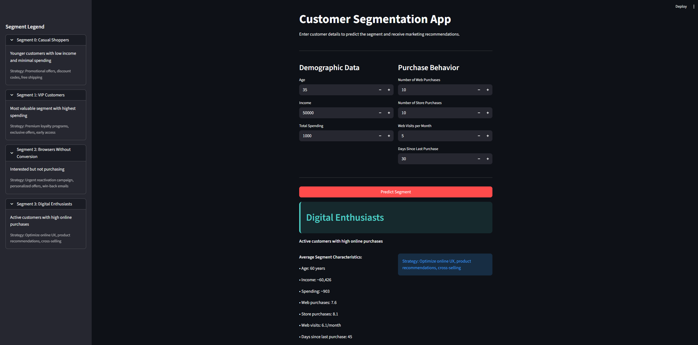
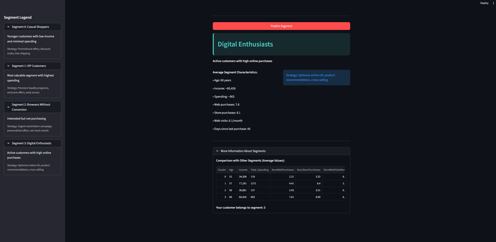

# Customer Segmentation

A machine learning clustering project that segments customers into distinct groups based on their demographics and purchasing behavior. The project analyzes over 2,200 customers using K-Means clustering to identify 4 unique customer segments, enabling targeted marketing strategies and personalized recommendations.

## Project Overview

This project performs unsupervised learning to discover natural customer groupings within the data. Using the Elbow Method, the optimal number of clusters (K=4) was determined, revealing distinct customer segments with unique characteristics and behaviors.

## Features

- **Comprehensive Data Analysis**: Deep dive into customer demographics and purchase patterns
- **K-Means Clustering**: Unsupervised segmentation with optimal K selection
- **Interactive Segment Explorer**: Web app with detailed segment profiles and recommendations
- **Visual Analytics**: PCA visualization of customer segments
- **Marketing Insights**: Tailored strategies for each customer segment

## Web Application

The Streamlit application provides an interactive interface for customer segmentation with:

**Input Features:**
- **Demographics:** Age, Income, Total Spending
- **Purchase Behavior:** Web purchases, Store purchases, Web visits per month
- **Engagement:** Days since last purchase

**Output:**
- Predicted customer segment
- Segment description and characteristics
- Average segment statistics
- Tailored marketing strategy recommendations

### Application Interface




### Segment Characteristics

Each segment displays:
- Average age
- Average income
- Average spending
- Web purchase frequency
- Store purchase frequency
- Web visit patterns
- Purchase recency


## Technologies Used

**Libraries:**
- `pandas` - Data manipulation and analysis
- `numpy` - Numerical computations
- `matplotlib` & `seaborn` - Data visualization
- `scikit-learn` - K-Means clustering, PCA, and data preprocessing
- `joblib` - Model serialization
- `streamlit` - Web application framework

**Machine Learning Technique:**
- **K-Means Clustering** (K=4, determined by Elbow Method)
- **PCA** - Dimensionality reduction for visualization
- **StandardScaler** - Feature normalization

## Project Workflow

### 1. Data Processing
- Cleaned dataset of 2,200+ customers
- Removed missing values
- Created new derived features
- Initial exploratory data analysis

### 2. Data Analysis
- In-depth analysis with comprehensive visualizations
- Identified key patterns in customer behavior
- Analyzed relationships between demographics and spending
- Explored purchase channel preferences

### 3. Clustering
- Normalized features using **StandardScaler**
- Applied **Elbow Method** to determine optimal K value
- Implemented **K-Means clustering** with K=4
- Visualized clusters using **PCA** (Principal Component Analysis)
- Identified 4 distinct customer segments

### 4. Customer Segments Identified

#### Segment 0: Casual Shoppers
- Younger customers with low income and minimal spending
- **Strategy:** Promotional offers, discount codes, free shipping

#### Segment 1: VIP Customers
- Most valuable segment with the highest spending
- **Strategy:** Premium loyalty programs, exclusive offers, early access

#### Segment 2: Browsers Without Conversion
- Interested but not purchasing
- **Strategy:** Urgent reactivation campaigns, personalized offers, win-back emails

#### Segment 3: Digital Enthusiasts
- Active customers with high online purchases
- **Strategy:** Optimize online UX, product recommendations, cross-selling

### Running the Application
```bash
streamlit run segmentation.py
```
